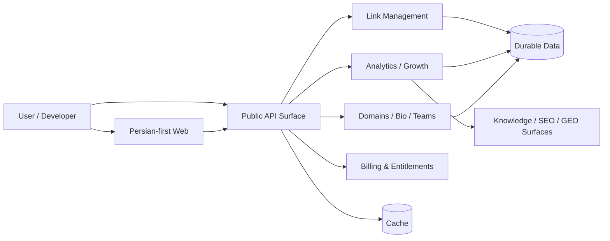

# 🔗 LinkResan | لینک‌رسان

### لینک هوشمند، تحلیل حرفه‌ای، تجربه فارسی‌محور
### Smart links, professional analytics, Persian-first product experience

**پلتفرم SaaS لینک‌رسان برای ساخت، مدیریت، تحلیل، توزیع و رشد لینک‌های حرفه‌ای — از کاربر مستقل تا تیم و توسعه‌دهنده.**

[🌐 وب‌سایت](https://linkresan.ir) · [💳 قیمت‌گذاری](https://linkresan.ir/pricing) · [📚 دانش‌نامه](https://linkresan.ir/knowledge) · [🧩 توسعه‌دهندگان](docs/DEVELOPERS.md) · [🗓 تاریخچه انتشار](docs/RELEASE_HISTORY_2026-09.md)

---

## وضعیت فعلی محصول | Current product truth

LinkResan فقط کوتاه‌کننده URL نیست؛ چرخه کامل لینک را پوشش می‌دهد: ساخت و کنترل لینک، QR، Link-in-bio، دامنه اختصاصی، تیم، API/Webhook، پرداخت و entitlement، تحلیل رفتار لینک و سطوح جدید Analytics Pro.

این repository عمداً **Public Product Showcase و Public Development Record** است. کد تجاری/عملیاتی Production در repository خصوصی canonical نگهداری می‌شود و این repository mirror قابل‌استقرار Production نیست.

> **Canonical Production source:** `AmirMotefaker/LinkResan-Production` (private)
>
> **Canonical public repository:** `LinkResan/LinkResan`

آخرین refresh عمومی این repository وضعیت تأییدشده Production را تا **2026-09-06** مستند می‌کند.

---

## ستون‌های محصول | Product pillars

| 🔗 Link Management | 📊 Analytics & Growth | ✨ Intelligence | 🧩 Platform |
|---|---|---|---|
| کوتاه‌سازی و alias دلخواه | آمار کلیک و روندها | نام‌گذاری لینک با AI | API Keys و Webhooks |
| انقضا و محدودیت کلیک | Analytics Pro P0 | Knowledge Engine فارسی | دامنه اختصاصی |
| لینک رمزدار و QR | Bio traffic tracking | Smart Links guidance | Link-in-bio و Teams |
| ساخت انبوه | UTM / referrer / conversion concepts | SEO/GEO entity foundation | Server-authoritative entitlements |

[جزئیات محصول](docs/PRODUCT.md) · [Roadmap](docs/ROADMAP.md) · [FAQ](docs/FAQ.md)

---

## قابلیت‌های تأییدشده | Verified capability status

| دسته | قابلیت | وضعیت |
|---|---|---|
| Link Management | کوتاه‌سازی لینک | ✅ Shipped |
| Link Management | اسلاگ دلخواه | ✅ Shipped |
| Link Management | تاریخ انقضا و محدودیت کلیک | ✅ Shipped |
| Link Management | لینک رمزدار | ✅ Shipped |
| Link Management | ساخت انبوه CSV | ✅ Shipped |
| Link Management | QR preview/download | ✅ Shipped |
| Intelligence | تولید نام با AI | ✅ Shipped |
| Analytics | آمار کلیک | ✅ Shipped |
| Analytics | Analytics Pro P0 | ✅ Shipped |
| Analytics | Bio traffic tracking | ✅ Shipped |
| Analytics | Usage meters / read-only usage dashboard | ✅ Shipped |
| Campaigns | UTM tooling | 🟡 Partial |
| Branding | دامنه اختصاصی | ✅ Shipped |
| Creator | Link-in-bio | ✅ Shipped |
| Developers | API Keys | ✅ Shipped |
| Developers | Webhooks | ✅ Shipped |
| Collaboration | Team management | ✅ Shipped |
| Localization | Persian / RTL | ✅ Shipped |
| Billing | پرداخت ریالی و entitlement verification | ✅ Shipped |
| SEO / GEO | Canonical entity/schema foundation | ✅ Shipped |
| Knowledge | Automated Persian Knowledge publishing + freshness guards | ✅ Shipped |
| Mobile | Android delivery workflow / Native client | 🟡 Preview / Partial |
| Open Source | مواد عمومی منتخب | 🟡 Partial — commercial Production remains private |

> `Partial` و `Preview` عمداً به‌عنوان `Shipped` تبلیغ نمی‌شوند. وضعیت عمومی باید با product truth تأییدشده در Production هم‌راستا بماند.

---

## تازه‌ترین milestoneها | Latest verified milestones

### 2026-09-06 — CRM360 analytics & Bio traffic
- تکمیل real analytics در CRM360.
- اضافه‌شدن Bio traffic tracking.
- migration لازم Production با health check قبل و بعد اعمال شد.

### 2026-09-05 — CRM360 / QR / Bio lookup
- نمایش بهتر لینک‌های کاربر در CRM360.
- QR اصلی با preview/download deterministic.
- Bio slug lookup بدون حساسیت به حروف بزرگ/کوچک.

### 2026-09-04 — Analytics Pro P0
- انتشار Analytics Pro P0 پس از exact-head Preview validation.
- انتشار Smart Links routing guide بعد از QA و freshness/public guards.

### 2026-09-03 — SEO/GEO & Knowledge
- پایه canonical entity/schema برای SEO و GEO.
- structured data غنی‌تر برای product landingها.
- comparison surfaceهای indexable.
- QR campaign guide و analytics intelligence refresh.

### 2026-08-24 تا 2026-08-25 — Usage, Knowledge & Mobile
- server-authoritative usage meters و usage dashboard.
- hardening چندمرحله‌ای Knowledge Engine و curated research.
- Android APK GitHub build workflow در pipeline خصوصی Production.

[مشاهده تاریخچه کامل September 2026 →](docs/RELEASE_HISTORY_2026-09.md)

---

## برای چه کسانی؟ | Built for

### کاربران و سازندگان محتوا
لینک کوتاه، QR، لینک رمزدار، تاریخ انقضا، محدودیت کلیک، دامنه اختصاصی و Link-in-bio در یک تجربه فارسی‌محور.

### تیم‌های رشد و بازاریابی
مدیریت لینک در مقیاس، Analytics Pro، usage visibility، UTM tooling، conversion/referrer concepts و همکاری تیمی.

### توسعه‌دهندگان
API Keys، Webhooks، OpenAPI و entry pointهای public-safe بدون انتشار implementation خصوصی Production.

[Developer entry point →](docs/DEVELOPERS.md)

---

## پلن‌ها | Plans

LinkResan چهار tier محصول دارد: **Free، Basic، Pro، Enterprise**. قیمت و entitlementها ممکن است تغییر کنند؛ صفحه [Pricing](https://linkresan.ir/pricing) مرجع عمومی قیمت است.

---

## معماری عمومی | Public architecture

این نمودار عمداً سطح بالا است. deployment identifiers، environment configuration، database URLs، gateway evidence، admin/CRM internals و private operational topology عمومی نمی‌شوند.

[معماری عمومی →](docs/ARCHITECTURE.md)

---

## Technology snapshot

| Layer | Technology |
|---|---|
| Web | Next.js 16, React 19, TypeScript |
| Backend | Go 1.25.x, Fiber 2.52.x |
| Data | PostgreSQL |
| Cache | Redis |
| API contract | OpenAPI |
| Mobile | React Native / Android delivery pipeline |
| UX | Persian-first RTL, responsive web |

---

## Trust, security & privacy boundary

Public material فقط claimهایی را منتشر می‌کند که قابل اتکا و public-safe باشند:

- authentication و session handling در سمت سرور enforce می‌شوند؛
- plan/entitlement enforcement server-authoritative است؛
- پرداخت ریالی فقط بعد از verification معتبر مبنای entitlement قرار می‌گیرد؛
- secrets، credentials، session tokens، customer data، database URLs، migration SQL، gateway identifiers و private audit evidence وارد public sync نمی‌شوند؛
- همگام‌سازی عمومی allowlist-based و fail-closed است؛
- Production source code و admin/CRM implementation خصوصی باقی می‌مانند.

برای گزارش آسیب‌پذیری، اطلاعات حساس را در Issue عمومی قرار ندهید و از مسیر تماس محصول استفاده کنید.

[Security guidance →](docs/SECURITY.md)

---

## Documentation hub

| سند | کاربرد |
|---|---|
| [PRODUCT.md](docs/PRODUCT.md) | تعریف محصول، مخاطب و capability map |
| [DEVELOPERS.md](docs/DEVELOPERS.md) | entry point توسعه‌دهندگان و credential hygiene |
| [ARCHITECTURE.md](docs/ARCHITECTURE.md) | معماری public-safe سطح بالا |
| [ROADMAP.md](docs/ROADMAP.md) | shipped / partial / not-shipped truth |
| [RELEASE_HISTORY_2026-09.md](docs/RELEASE_HISTORY_2026-09.md) | milestoneهای Production از 2026-08-22 تا 2026-09-06 |
| [SECURITY.md](docs/SECURITY.md) | disclosure و safety boundary |
| [BRAND.md](docs/BRAND.md) | قواعد public positioning و copy |
| [FAQ.md](docs/FAQ.md) | پاسخ کوتاه به پرسش‌های پرتکرار |

---

## Public / Private boundary

### Public — `LinkResan/LinkResan`

- brand and product showcase
- public-safe capability/status documentation
- public release history and sanitized roadmap
- Issue / PR / commit / review history for public changes
- developer entry points and selected examples

### Private — `AmirMotefaker/LinkResan-Production`

- canonical Production source
- backend/frontend/mobile commercial implementation
- admin/CRM implementation
- payment and reconciliation internals
- deployment workflows and environment configuration
- migration implementation and private operational evidence

**The private Production repository remains the sole production source of truth.**

---

## GitHub governance & freshness model

Public updates follow:

`Issue → Branch → Commits → Pull Request → Code Review → Merge`

Production changes are summarized publicly only after they are verified and sanitized. The public repository is **not** updated by mirroring private Git history.

Current refresh record: [Issue #13](https://github.com/LinkResan/LinkResan/issues/13)

---

## Support & contact

- Product: https://linkresan.ir
- Knowledge base: https://linkresan.ir/knowledge
- Contact: https://linkresan.ir/contact
- Public issues: https://github.com/LinkResan/LinkResan/issues

---

**LinkResan — ساخت لینک کمتر نیست؛ مدیریت تجربه و داده لینک است.**

Public product truth refreshed through 2026-09-06 · tracked by Issue #13

